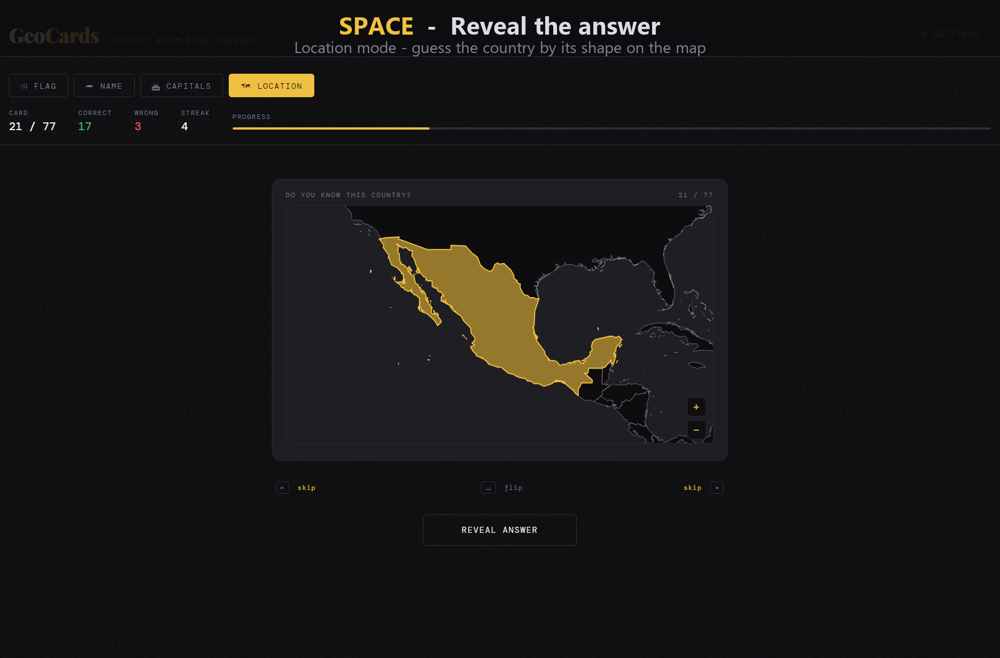
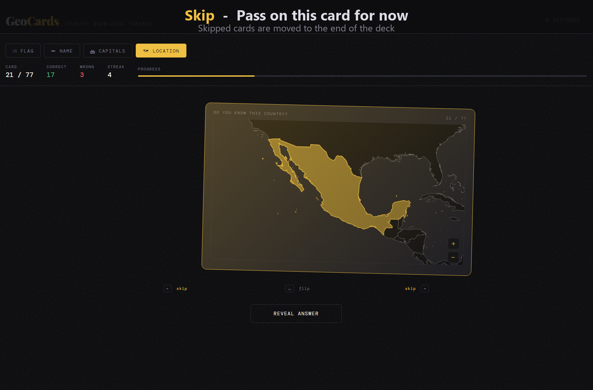
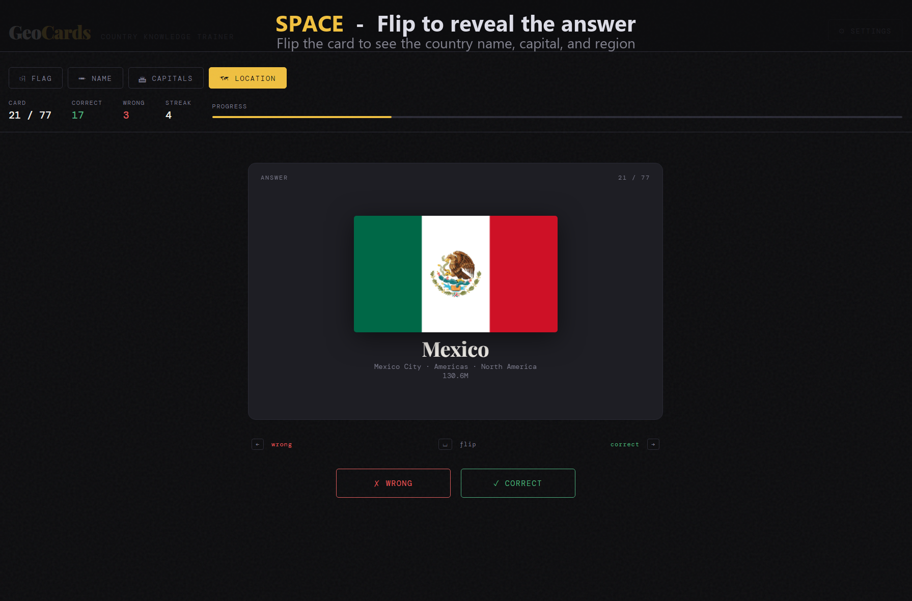
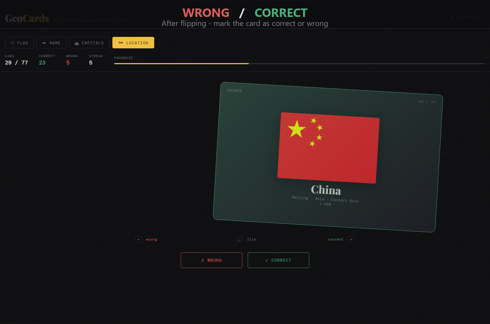

# GeoCards
A free flashcard app to learn countries. 

I've always wanted to be more knowledgeable about countries, so I decided to make a lightweight game out of it!
Hosted [here](https://andrewvlad.github.io/GeoCards/) on GitHub.
Requires an internet connection to fetch country data from the [REST Countries API](https://restcountries.com).

|     |           |
|-------------------------------------------------------------------------|----------------------------------------------------------------------------------|
|  |  |

## Modes
- Location - Recognize the country by geographic location
- Flag - Recognize the country by flag
- Name - Recognize the country by name
- Capital - Recognize the country by capital city/cities

## Features
- Auto-saves session, stats, and settings to localStorage
- Keybindings and gesture controls
    - `[SPACE]` (or tap) - Flip card
    - `[←]`/`[→]` (or swipe) - Mark wrong/correct/skip

## Settings
- Filter countries by population and area
- Recycle wrong cards

## TODO
- [x] Mobile support
- [x] Add skipping
- [x] Display population
- [x] Display capitals
- [x] Capitals mode
- [ ] Multiple choice mode
- [x] Population filter
- [ ] -dles (daily) mode
- [ ] Downloadable file with internal CSS

## Overview
The app runs entirely clientside using HTML/CSS/JS.
Country data is fetched from the [REST Countries](https://restcountries.com/) API.
Borders are rendered on a [Leaflet](https://leafletjs.com/) map using [Natural Earth](https://www.naturalearthdata.com/downloads/)'s vector data.
Progress and settings are saved using localstorage. 
Card swiping is supported for both mobile touch gestures and desktop dragging.

# Disclaimer
I do not manage the borders, nor sovereignty of the countries.
Those are managed by the APIs in use themselves.
Feel free to fork to match your political beliefs.
